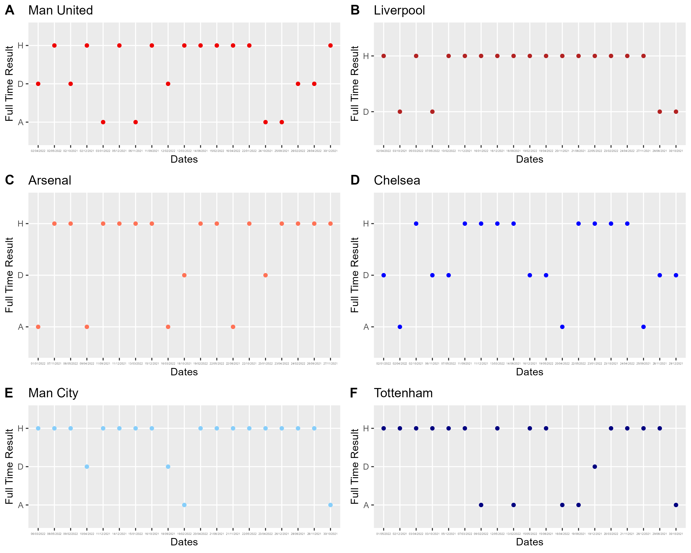
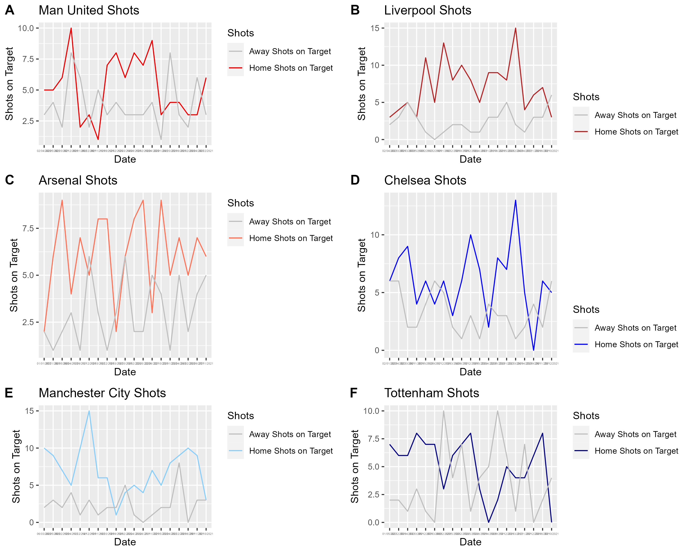
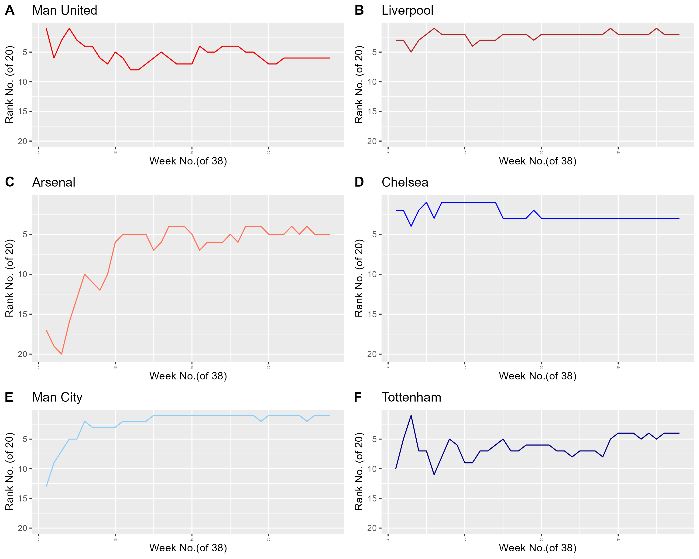

```{r setup, include=TRUE}
knitr::opts_chunk$set(echo = TRUE)
```

## Final Write-Up

#### Introduction

The theme of my data story revolves around soccer, specifically the 21-22 English Premier League (EPL). As the current 23-24 EPL season rages on, football fans can often feel the difference between home games and away games. The research question, "How influential was the home advantage for the Big Six football clubs in the 21-22 premier league season?" is hence one that is important to address in the interests of football fans, both old and new.

### Methodology

Using a recent season like the 21-22 EPL season can be useful to help answer this research question. Taking data sources form 21-22 EPL season, variables like weekly rankings for each EPL team, the individual match statistics including full time and half time results, the number of fouls and red or yellow cards, the referees of each game, can be extremely useful. This is because there can be many factors affecting the result of the game. However, investigating the effect of home advantage would mean that the independent variable would be the home team and the dependent variables would be the shots on target, the half time and full time results, etc.\
\
With these in mind, I depicted the findings of a comparison in scatter plots of the home team wins against away team wins for each of the Big 6 Football clubs in the EPL. This helps to create an overview of the overall influence of home advantage at a glance. Subsequently, I depicted a visual comparison of the influence of home advantage on shots on target, since many football fans attribute the ability of the football club to clinch shots on target as a defining contributing factor to their success/wins. This was done through line graphs, which compared each team's performance in terms of shots on target to the away games or home games. Lastly, a visual representation of the weekly rankings in line graphs was depicted as this visually allowed viewers to see the influence of home games on the Big Six teams' wins in the EPL. This also added a chronological factor to the analysis.

### Discussion

From the findings, it is clear that from a glance, most of the time the home team will get a win when playing on home grounds. This is most prominent in the case of Liverpool, where out of 20 games, up to 16 games were Home Team wins, and the rest were draws.

```{r, echo=FALSE}
#| eval: TRUE
#| out.width: "70%"
#| fig-align: center
#| caption: Home Team vs Away Team Wins

```

The advantage could be constituted by the number of shots on target for the home teams on home grounds, considering how they may be used to playing with the specific environments on home ground.

Hence, looking at all six teams' shots on target when on home grounds as opposed to their opponents:

```{r, echo=FALSE}
#| eval: TRUE
#| out.width: "70%"
#| fig-align: center

```

For all of the teams, the home team lines largely seem to be greater than that of the away teams. This is further highlighted for teams A to E, Manchester United, Liverpool, Arsenal, Chelsea and Manchester City, whose home shots on target seem to spike much more in matches against away teams, reaching highs that pull the difference apart. However, Tottenham is an exception, with the highest scores being held by the away teams, hitting up to 10 shots on target. Hence, overall, it seems that the home advantage was indeed influential in helping team have more shots on target.

Now further looking at the influence on weekly rankings to further consider another dependent variable to be the weekly rankings of the Big Six football teams.

```{r, echo=FALSE}
#| eval: TRUE
#| out.width: "70%"
#| fig-align: center

```

From the above graph, we can see that most of the teams seem to stay largely at the top ranks for each week, especially teams like Liverpool, Chelsea, and Manchester United. Hence, we take a look at the proportion of games overall played on home ground for each of these three teams to compare and from the data collected above we know that each team has the same number of games (19) played on home ground and each get to be the "Home Team" for 19 matches.

### Conclusion

All in all, it is clear that most of the teams playing on home ground do have some advantage, and it does have significant contribution for the games, however there are exceptions such as for teams like the Tottenham Hotspurs, and in such cases it is valuable to consider other variable factors affecting the gameplay of the teams involved.

### References:

| *Premier league competition format & history \| premier league*. (n.d.). Retrieved 6 November 2023, from <https://www.premierleague.com/premier-league-explained>

| *Premier League match data 2021-2022*. (2022, September 25). Kaggle. <https://www.kaggle.com/datasets/evangower/premier-league-match-data>

| Rfordatascience. (n.d.). *GitHub - rfordatascience/tidytuesday: Official repo for the #tidytuesday project*. GitHub. <https://github.com/rfordatascience/tidytuesday/>

| *Who are the Premier League 'big six'? Top English clubs & nickname explained*. (2021, August 13). <https://www.sportingnews.com/ca/soccer/news/who-are-premier-league-big-six-top-english-clubs-nickname-explained/8onqxiy3jynf1qr8b8kt8aags>
